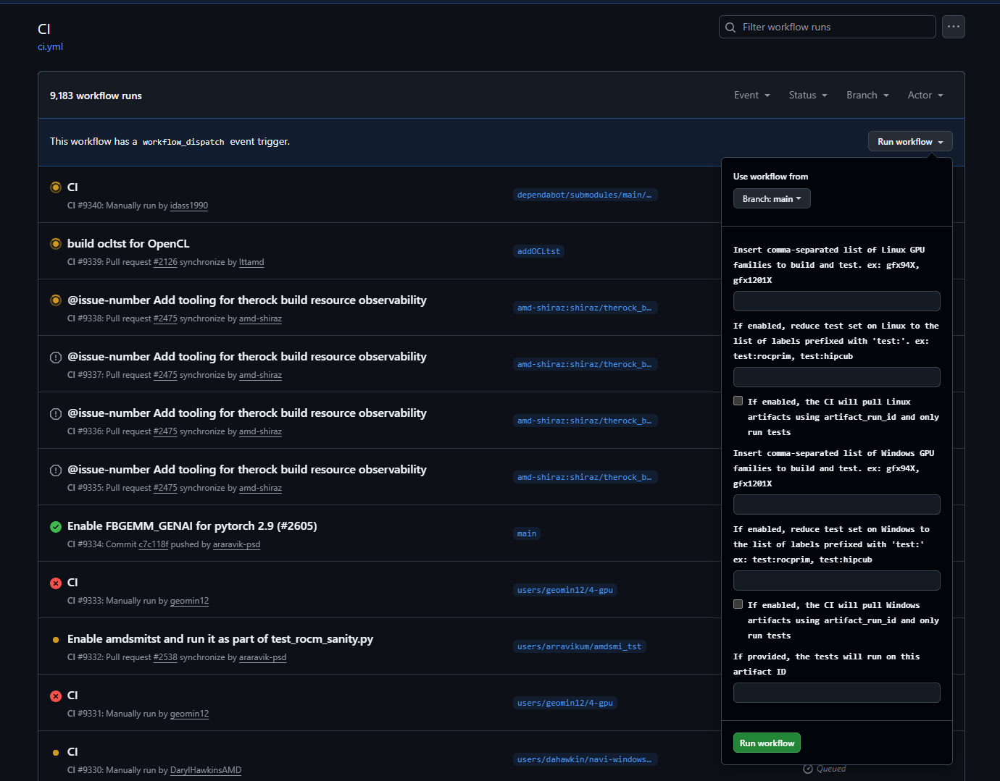

# CI Behavior Manipulation

TheRock CI is controlled by [`configure_ci.py`](../../build_tools/github_actions/configure_ci.py), where it controls push, pull request, workflow dispatch and schedule CI behavior.

## Push behavior

For `push`, TheRock CI only runs builds and tests when pushed to the `main` branch. From [`amdgpu_family_matrix.py`](../../build_tools/github_actions/amdgpu_family_matrix.py), TheRock CI collects the AMD GPU families from `amdgpu_family_info_matrix_presubmit` and `amdgpu_family_info_matrix_postsubmit` dictionaries, then runs builds and tests.

## Pull request behavior

For `pull_request`, TheRock CI collects the `amdgpu_family_info_matrix_presubmit` dictionary from [`amdgpu_family_matrix.py`](../../build_tools/github_actions/amdgpu_family_matrix.py) and runs build/tests.

However, if additional options are wanted, you can add a label to manipulate the behavior. The labels we provide are:

- `skip-ci`: The CI will skip all builds and tests
- `gfx...`: A build and test (if a test machine is available) is added to the CI matrix for the specified gfx family. (ex: `gfx120X`, `gfx950`)
- `test:...`: The full test will run only for the specified label and other labeled projects (ex: `test:rocthrust`, `test:hipblaslt`)

## Workflow dispatch behavior

For `workflow_dispatch`, you are able to trigger CI in [GitHub's ci.yml workflow page](https://github.com/ROCm/TheRock/actions/workflows/ci.yml). To trigger a workflow dispatch, click "Run workflow" and fill in the fields accordingly:

## Schedule behavior

For `schedule` runs, the `CI Nightly` runs everyday at 2AM UTC. This collects all families from [`amdgpu_family_matrix.py`](../../build_tools/github_actions/amdgpu_family_matrix.py), running all builds and tests.
